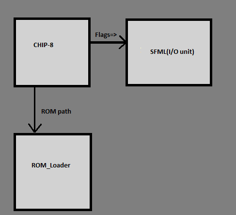

# CHIP-8
classic chip8 (! some opcode names changed)

TODO

   - <s>check ROM loading errors</s>
   - <s>add cmake </s> file (i am newbie at this)
   - <s>remove utils func inside of chip8</s>
   - add better ROMs for testing
   - add diagram about chip8 I/O relation and flags
   - move the opcodes to somewhere else
   - add binary file reader from CHIP_Assembler ?(i dont remember where was func)
   - release

test image<br>


```
.mch8(machine(code) chip8) structure (enum => EMU_TEXT_ROM)
ROMB
   0x0f,0x0f,0xff...
ROME

VARB
   255,15,65,78,34,0
VARE

CODEB

  CLS
  OR
  XOR
  AND

CODEF
```
